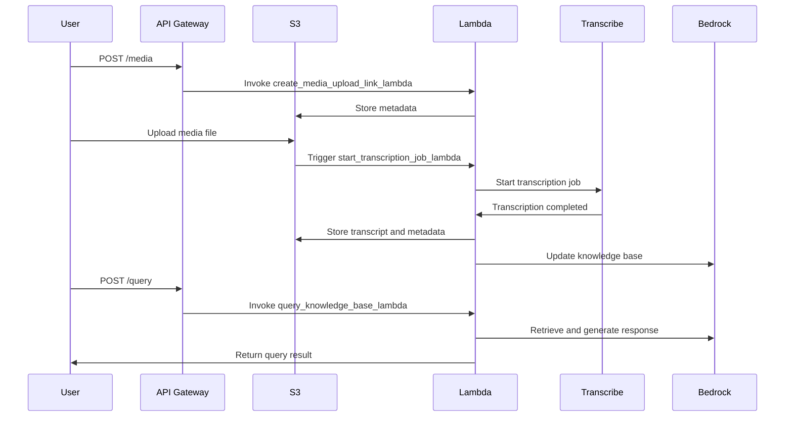

# 🏗 Architecture Documentation

## 📖 Context
* **Goal of the Repository**: This repository is part of an application named "easy-rag" designed to facilitate media transcription and knowledge base querying. The application provides business value by automating the transcription of media files and enabling efficient querying of a knowledge base using AWS services. It leverages AWS Lambda for serverless computing, AWS S3 for storage, and AWS Transcribe for transcription services.
* **Used Services and Libraries**:
  - **AWS Services**: Lambda, S3, Transcribe, API Gateway, CloudWatch, IAM, Secrets Manager, SQS, Bedrock Agent.
  - **Third-party Libraries**: Pinecone for vector storage, `serde_json` for JSON serialization, `nanoid` for generating unique IDs, and `reqwest` for HTTP requests.

## 📖 Overview
* **Architecture Overview**: The architecture is serverless, primarily using AWS Lambda functions to handle various tasks such as starting transcription jobs, handling successful transcriptions, creating media upload links, and querying the knowledge base. The system uses AWS S3 for storing media files and metadata, and AWS Transcribe for converting media files into text. The application also integrates with Pinecone for vector storage and retrieval.
* **Component Interaction**: 
  - Media files are uploaded to S3, triggering a Lambda function to start a transcription job.
  - Once transcription is complete, another Lambda function processes the result, storing metadata and transcripts in S3 and updating the knowledge base.
  - API Gateway routes HTTP requests to Lambda functions for creating upload links and querying the knowledge base.
* **Design Patterns and Architectural Decisions**:
  - **Serverless Architecture**: Utilizes AWS Lambda for scalable, event-driven processing.
  - **Event-Driven Architecture**: S3 events trigger Lambda functions to start transcription jobs.
  - **Microservices**: Each Lambda function acts as a microservice with a specific responsibility.

## 🔹 Components
| Component Name                        | Description                                                                                   |
|---------------------------------------|-----------------------------------------------------------------------------------------------|
| `create_media_upload_link_lambda`     | Generates presigned S3 URLs for media uploads and stores metadata.                            |
| `start_transcription_job_lambda`      | Initiates transcription jobs for uploaded media files using AWS Transcribe.                   |
| `handle_successful_transcription_lambda` | Processes completed transcriptions, stores results, and updates the knowledge base.          |
| `query_knowledge_base_lambda`         | Handles queries to the knowledge base, retrieving and generating responses using Bedrock Agent.|

## 🔄 Data Flow
| Data Flow Step                        | Description                                                                                   |
|---------------------------------------|-----------------------------------------------------------------------------------------------|
| Media Upload                          | User uploads media to S3, triggering the `start_transcription_job_lambda`.                    |
| Transcription Job                     | The Lambda function starts a transcription job using AWS Transcribe.                          |
| Transcription Completion              | Upon completion, `handle_successful_transcription_lambda` processes the result.               |
| Metadata and Transcript Storage       | Transcription results and metadata are stored in S3 and the knowledge base is updated.        |
| Knowledge Base Query                  | API Gateway routes queries to `query_knowledge_base_lambda`, which retrieves data from Bedrock.|

## 🔍 Mermaid Diagram

## 🧱 Technologies
| Technology          | Description                                                                                   |
|---------------------|-----------------------------------------------------------------------------------------------|
| AWS Lambda          | Serverless compute service for running code in response to events.                            |
| AWS S3              | Object storage service used for storing media files and metadata.                             |
| AWS Transcribe      | Service for converting speech to text.                                                        |
| AWS API Gateway     | Manages API requests and routes them to appropriate Lambda functions.                         |
| AWS CloudWatch      | Monitoring and logging service for AWS resources.                                             |
| AWS IAM             | Manages access to AWS services and resources.                                                 |
| AWS Secrets Manager | Securely stores and manages sensitive information such as API keys.                           |
| Pinecone            | Vector database for storing and querying high-dimensional data.                               |
| Rust                | Programming language used for implementing Lambda functions.                                  |

## 📝 **Codebase Evaluation**
* **Dependency & Coupling**: The codebase effectively uses AWS SDKs and third-party libraries, maintaining a modular structure with each Lambda function handling specific tasks. However, there is a potential for tight coupling between Lambda functions and AWS services, which could be mitigated by abstracting service interactions.
* **Code Complexity**: The code is well-structured with clear separation of concerns. However, error handling could be improved by providing more detailed error messages and using a consistent error handling strategy.
* **Cloud Anti-patterns**: 
  - **Hardcoded Secrets**: The use of AWS Secrets Manager mitigates the risk of hardcoded secrets.
  - **Inefficient Scaling**: The serverless architecture inherently supports scaling, but monitoring and optimizing Lambda execution times could further enhance performance.
  - **Improper Error Handling**: Implementing a centralized logging and error tracking mechanism could improve error visibility and resolution.

**Actionable Suggestions**:
- Consider using a configuration management tool to manage environment variables and reduce potential coupling.
- Enhance error handling by implementing a consistent strategy across all Lambda functions.
- Regularly review and optimize Lambda function execution times to ensure efficient scaling and cost management.